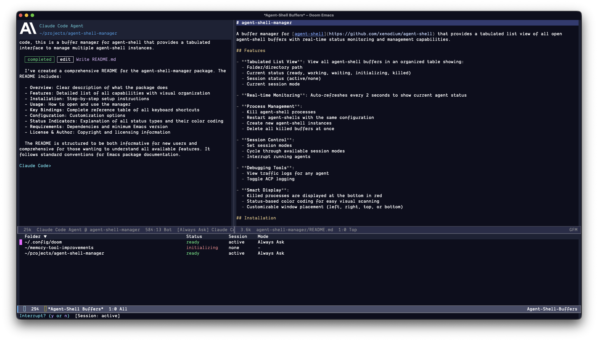

# agent-shell-manager

(fully vibe-coded) buffer manager for [agent-shell](https://github.com/xenodium/agent-shell) that provides a tabulated list view of all open agent-shell buffers with real-time status monitoring and management capabilities.



## Features

- **Tabulated List View**: View all agent-shell buffers in an organized table showing:
  - Folder/directory path
  - Current status (ready, working, waiting, initializing, killed)
  - Session status (active/none)
  - Current session mode
  
- **Real-time Monitoring**: Auto-refreshes every 2 seconds to show current agent status

- **Process Management**:
  - Kill agent-shell processes
  - Restart agent-shells with the same configuration
  - Create new agent-shell instances
  - Delete all killed buffers at once

- **Session Control**:
  - Set session modes
  - Cycle through available session modes
  - Interrupt running agents
  
- **Debugging Tools**:
  - View traffic logs for any agent
  - Toggle ACP logging

- **Smart Display**:
  - Killed processes are displayed at the bottom in red
  - Status-based color coding for easy visual scanning
  - Customizable window placement (left, right, top, bottom, or
    user-controlled)

## Installation

1. Ensure you have [agent-shell](https://github.com/xenodium/agent-shell) installed
2. Place `agent-shell-manager.el` in your Emacs load path
3. Add to your Emacs configuration:

```elisp
(require 'agent-shell-manager)
```

## Usage

### Opening the Manager

```elisp
M-x agent-shell-manager-toggle
```

This command toggles the visibility of the agent-shell buffer manager. By default, it appears at the bottom of the frame.

### Key Bindings

Once the manager buffer is open, you can use these keys:

| Key         | Action                                    |
|-------------|-------------------------------------------|
| `RET`       | Switch to agent-shell buffer at point    |
| `g`         | Refresh buffer list                       |
| `k`         | Kill agent-shell process                  |
| `c`         | Create new agent-shell                    |
| `r`         | Restart agent-shell                       |
| `d`         | Delete all killed buffers                 |
| `m`         | Set session mode                          |
| `M`         | Cycle session mode                        |
| `C-c C-c`   | Interrupt agent                           |
| `t`         | View traffic logs                         |
| `l`         | Toggle logging                            |
| `q`         | Quit manager window                       |

## Configuration

### Window Position

Customize where the manager window appears:

```elisp
;; Options: 'left, 'right, 'top, 'bottom, or nil
(setq agent-shell-manager-side 'bottom)
```

When set to `nil`, the package defers to your `display-buffer-alist`
configuration and window management frameworks (such as shackle,
popper.el, etc.), giving you full control over window placement:

```elisp
;; Use dedicated window with user-controlled placement
(setq agent-shell-manager-side nil)
```

## Status Indicators

The manager displays the following status values with color coding:

- **Ready** (green): Agent is fully operational and waiting for your input
- **Working** (yellow): Agent is actively processing your request
- **Waiting** (blue): Agent is waiting for user input or permission approval
- **Starting...** (gray): Agent is initializing and starting up
- **No Session** (gray): Agent process is running but no conversation session has been established
- **Killed** (red): Process has been terminated
- **Unknown** (gray): Status cannot be determined (should not occur normally)

## Requirements

- Emacs 25.1 or later
- [agent-shell](https://github.com/xenodium/agent-shell) package
- `tabulated-list` mode (built-in)

## License

This package is free software; you can redistribute it and/or modify it under the terms of the GNU General Public License as published by the Free Software Foundation; either version 3, or (at your option) any later version.

## Author

Copyright (C) 2025 Jethro Kuan

## Contributing

Contributions are welcome! Please feel free to submit issues or pull requests.
